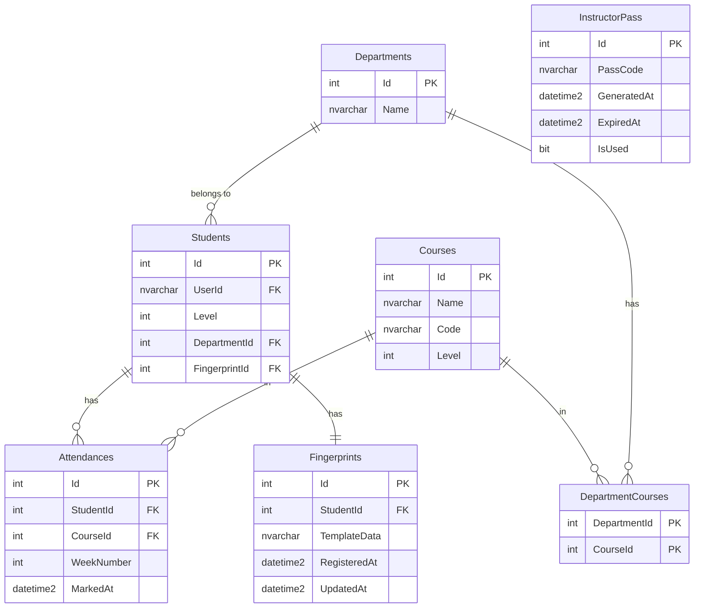

# 🖐️ BiometricAttendance

A production-ready fingerprint-based attendance management system built with **ASP.NET Core 10** following **Clean Architecture** principles. Designed for educational institutions to replace paper-based attendance with a secure, efficient, and tamper-proof biometric solution.

---

## 📋 Table of Contents

- [Overview](#overview)
- [Features](#features)
- [Architecture](#architecture)
- [Domain Model](#domain-model)
- [Tech Stack](#tech-stack)
- [Getting Started](#getting-started)
- [API Documentation](#api-documentation)
- [Security](#security)
- [Roadmap](#roadmap)

---

## 🔍 Overview

BiometricAttendance is a graduation project that integrates real fingerprint hardware with a clean, scalable backend API. The system handles the full lifecycle of biometric attendance — from fingerprint registration and verification to attendance analytics and report generation.

> ⚠️ This project uses **real fingerprint hardware** for biometric authentication, not simulation.

---

## ✨ Features

### 🔐 Authentication & Security
- **Biometric Authentication** — Real fingerprint hardware integration for tamper-proof verification
- **JWT + Refresh Token** — Secure, stateless authentication with token renewal support
- **Role-based Access Control** — Granular permissions for Admins, Instructors, and Students
- **Rate Limiting** — Protection on sensitive biometric endpoints
- **Global Exception Handling** — Consistent, production-ready error responses

### 👥 User & Course Management
- Full user lifecycle management (Admins, Instructors, Students)
- Department and Course creation with assignment workflows
- Fingerprint registration and re-enrollment per student

### 📊 Attendance & Analytics
- Real-time attendance marking via fingerprint scan
- Per-student attendance percentage per course
- Instructor-level attendance overview and insights
- Weekly academic period tracking

### 📁 Reporting
- Export attendance reports to **PDF** and **Excel**
- Bulk export for entire courses
- Filterable by course, department, date range, and student

### 🔔 Notifications
- Automated alerts when a student exceeds absence threshold
- Powered by **Hangfire** background jobs (no extra infrastructure needed)

### ⚙️ Infrastructure & Observability
- **Audit Logging** — Full traceability of who did what and when
- **Health Checks** — Built-in endpoint monitoring
- **Structured Logging** — via Serilog for production diagnostics
- **API Versioning** — Backward-compatible endpoint evolution
- **Docker Support** — One-command setup with `docker-compose`

---

## 🏗️ Architecture

The project follows **Clean Architecture** with strict separation of concerns and unidirectional dependency flow.

```
BiometricAttendance/
│
├── BiometricAttendance.Core/            # Domain Layer
│   ├── Entities/                        # Domain entities
│   ├── Interfaces/                      # Repository, service & fingerprint contracts
│   └── Exceptions/                      # Domain-specific exceptions
│
├── BiometricAttendance.Application/     # Application Layer
│   ├── Services/                        # Use case implementations
│   ├── DTOs/                            # Data transfer objects
│   ├── Mappers/                         # Entity ↔ DTO mapping
│   └── Interfaces/                      # Application service contracts
│
├── BiometricAttendance.Infrastructure/  # Infrastructure Layer
│   ├── Data/                            # DbContext & EF Core configs
│   ├── Repositories/                    # Repository implementations
│   ├── Identity/                        # JWT & Auth services
│   ├── BackgroundJobs/                  # Hangfire job definitions
│   └── Fingerprint/                     # Fingerprint module (hardware abstraction)
│       ├── Services/                    # Hardware integration & processing
│       └── Models/                      # Biometric data models
│
└── BiometricAttendance.Presentation/   # Presentation Layer (API)
    ├── Controllers/                     # API endpoints (v1, v2)
    ├── Middleware/                      # Global exception handler, logging
    ├── Extensions/                      # DI registration & app config
    └── Program.cs
```

### Dependency Flow

```
Presentation → Application → Core
Infrastructure → Core
```

> No layer depends on an outer layer. The **Core** has zero external dependencies.
> Fingerprint interfaces live in **Core** — the hardware implementation stays in **Infrastructure**.

---

## 🧩 Domain Model



### Key Entities

| Entity | Description |
|---|---|
| `Student` | Student profile linked to an identity user, holds level and department |
| `Department` | Academic department grouping students and courses |
| `Course` | Subject offered at a specific level, can be shared across departments |
| `DepartmentCourse` | Junction table — a course can belong to multiple departments |
| `Attendance` | Record of a student's presence, identified by week number and timestamp |
| `Fingerprint` | Isolated biometric template per student with registration audit |
| `InstructorPass` | Single-use time-limited code generated by SuperInstructor for Instructor registration |

> **Roles** (`SuperInstructor`, `Instructor`, `Student`) and auth concerns (`RefreshTokens`, `ApplicationUser` extensions) are managed at the identity layer and intentionally excluded from the business schema.

---

## 🛠️ Tech Stack

| Layer | Technology |
|---|---|
| Framework | ASP.NET Core 10 |
| ORM | Entity Framework Core + SQL Server |
| Authentication | JWT Bearer + Refresh Tokens |
| Background Jobs | Hangfire |
| Logging | Serilog |
| API Docs | Scalar |
| Health Checks | AspNetCore.HealthChecks |
| API Versioning | Asp.Versioning |
| Containerization | Docker + docker-compose |
| Reporting | (PDF / Excel export) |

---

## 🚀 Getting Started

### Prerequisites

- [.NET 10 SDK](https://dotnet.microsoft.com/download)
- [Docker Desktop](https://www.docker.com/products/docker-desktop) *(optional but recommended)*
- SQL Server or use the Docker setup below

### Option 1 — Docker (Recommended)

```bash
git clone https://github.com/your-username/BiometricAttendance.git
cd BiometricAttendance
docker-compose up --build
```

The API will be available at `http://localhost:5000`
Scalar docs at `http://localhost:5000/scalar`

### Option 2 — Local Setup

```bash
git clone https://github.com/your-username/BiometricAttendance.git
cd BiometricAttendance

# Restore dependencies
dotnet restore

# Apply migrations
dotnet ef database update --project BiometricAttendance.Infrastructure

# Run
dotnet run --project BiometricAttendance.Presentation
```

### Configuration

Update `appsettings.json` with your values:

```json
{
  "ConnectionStrings": {
    "DefaultConnection": "Server=.;Database=BiometricAttendanceDb;Trusted_Connection=True;"
  },
  "JWT": {
    "Key": "your-secret-key",
    "Issuer": "BiometricAttendance",
    "Audience": "BiometricAttendanceUsers",
    "ExpiryMinutes": 60,
    "RefreshTokenExpiryDays": 7
  }
}
```

---

## 📝 API Documentation

Interactive API docs are available via **Scalar** at `/scalar` when running locally.

### Endpoint Groups

| Group | Description |
|---|---|
| `auth` | Login, refresh token, logout |
| `users` | User management (Admin only) |
| `students` | Student registration & profiles |
| `departments` | Department CRUD |
| `courses` | Course management & assignments |
| `fingerprint` | Register & verify biometric data |
| `attendance` | Mark & query attendance records |
| `reports` | Export PDF / Excel attendance reports |
| `analytics` | Attendance statistics per student/course |
| `health` | System health check |

---

## 🔒 Security

- **JWT Bearer Authentication** with short-lived access tokens
- **Refresh Token Rotation** — tokens are invalidated after use
- **Role-based Authorization** — `Admin`, `Instructor`, `Student`
- **Rate Limiting** — applied to fingerprint and auth endpoints
- **Audit Logging** — every data mutation is logged with user + timestamp
- **HTTPS enforced** in production
- **Biometric data** is stored as encrypted references, never raw images

---

## 🗺️ Roadmap

### ✅ Phase 1 — Core System
- [x] Clean Architecture setup
- [x] JWT Authentication
- [x] User & Role management
- [x] Department & Course management
- [x] Fingerprint hardware integration
- [x] Real-time attendance marking

### 🔄 Phase 2 — Quality & Reliability *(In Progress)*
- [ ] Fix N+1 query issues with proper projections
- [ ] Add `AsNoTracking` on read-only queries
- [ ] Implement `IMemoryCache` / `IDistributedCache` for hot data
- [ ] Global Exception Handler middleware
- [ ] Refresh Token implementation
- [ ] Rate Limiting on sensitive endpoints

### 📦 Phase 3 — Features & Observability
- [ ] PDF & Excel report export
- [ ] Absence notification system via Hangfire
- [ ] Per-student attendance analytics endpoint
- [ ] Audit logging middleware
- [ ] Docker + docker-compose setup

### 🧪 Phase 4 — Testing & Deployment
- [ ] Integration tests on core endpoints
- [ ] GitHub Actions CI pipeline
- [ ] Production deployment documentation

---

## 🤝 Contributing

This is a graduation project. Feedback, suggestions, and issues are welcome via [GitHub Issues](https://github.com/your-username/BiometricAttendance/issues).

---

## 📄 License

This project is licensed under the MIT License — see the [LICENSE](LICENSE) file for details.

---

<div align="center">
  Built with ❤️ using ASP.NET Core 10 | Clean Architecture | Real Biometric Hardware
</div>
